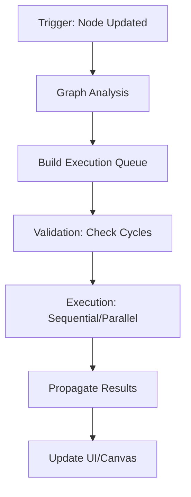

# Execution Model

Hệ thống Cluster sử dụng mô hình **Directed Acyclic Graph (DAG)** để quản lý việc thực thi các Node xử lý dữ liệu.

## 1. Execution Lifecycle

Khi một Node bị thay đổi (cấu hình hoặc dữ liệu nguồn), hệ thống sẽ trải qua các bước sau:

1.  **Trigger**: Xảy ra khi người dùng thay đổi config trong Node hoặc nhấn "Refresh" dữ liệu từ Google Sheets.
2.  **Graph Analysis**: Duyệt qua toàn bộ Edges để xác định các Node con (downstream) bị ảnh hưởng.
3.  **Execution Queue**: Sắp xếp các Node theo thứ tự phụ thuộc (Topological Sort). Node nguồn chạy trước, Node kết quả chạy sau.
4.  **Validation**: Đảm bảo không có vòng lặp (circular dependency). Nếu có, dừng thực thi và báo lỗi trên UI.
5.  **Execution**: Chạy các `Executors` tương ứng với từng loại Node.
6.  **Propagation**: Kết quả của Node cha được truyền làm Input cho Node con.

---

## 2. Dependency Tracking

Hệ thống sử dụng cơ chế **Reactive Updates**:
- Mỗi Node giữ một `hash` của Input Data + Config.
- Nếu `hash` không đổi, Node sẽ lấy kết quả từ **Cache** thay vì thực thi lại (tối ưu hiệu năng).
- Nếu `hash` thay đổi, Node sẽ thực thi lại và đánh dấu tất cả downstream nodes là `dirty`.

---

## 3. SQL Execution Flow (AlaSQL Integration)

Đối với các Node xử lý dữ liệu (Hub, Pivot), luồng xử lý như sau:

1.  **Query Generation**: Chuyển đổi Config của Node (hoặc SQL tay) thành câu lệnh AlaSQL.
2.  **Virtual Table Mapping**: Ánh xạ các Input Dataset ID thành tên bảng trong môi trường AlaSQL.
3.  **In-Memory Execution**: Chạy query trong bộ nhớ RAM (Memory).
4.  **Result Ingest**: Chuyển đổi kết quả từ AlaSQL format sang Cluster Dataset format.

---

## 4. Constraints & Optimization

- **Max Graph Depth**: Giới hạn độ sâu của pipeline (ví dụ: 20 nodes) để tránh tràn stack.
- **Async Execution**: Các Node xử lý nặng sẽ được chạy trong `requestIdleCallback` hoặc `Web Worker` để tránh block UI.
- **Batch Processing**: Nếu nhiều Node thay đổi cùng lúc, hệ thống sẽ gom nhóm lại để chạy một lượt (Debounce).

---

# Related
- [[pipeline-runtime]]
- [[alasql-architecture]]
- [[data-flow]]
- [[index]]
